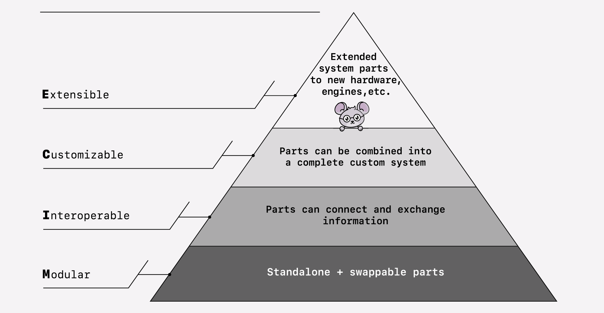

# Modern, open and downward-scaleable data engineering

Source code for a 3-hour lecture to get started with the composable data stack.

This work is licensed under <a href="https://creativecommons.org/licenses/by/4.0/?ref=chooser-v1" target="_blank" rel="license noopener noreferrer" style="display:inline-block;">CC BY 4.0</a>
